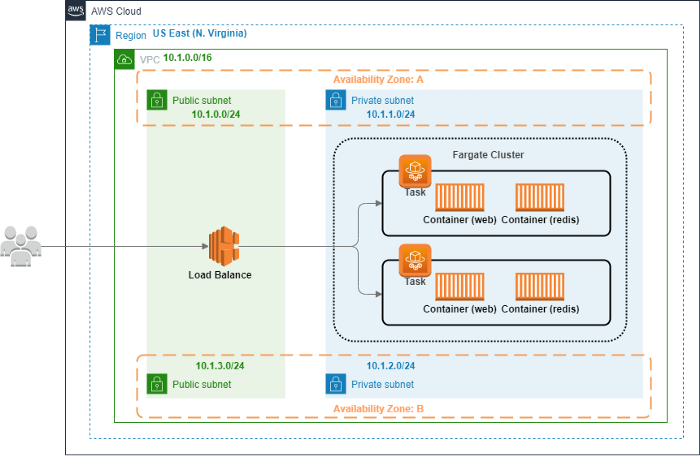
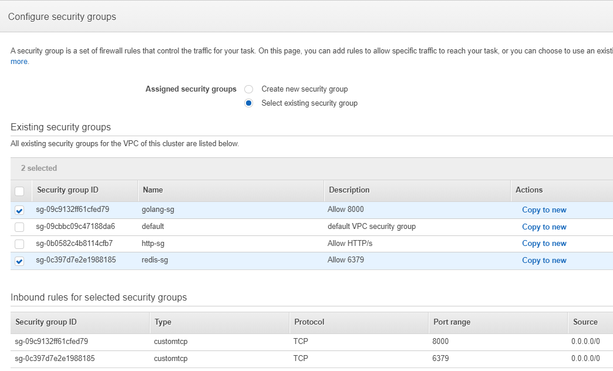

# AWS Elastic Container Service (ECS)

## Introduction

### What is Amazon Elastic Container Service?
Amazon ECS is a highly scalable, fast container management service that makes it easy to run, stop, and manage containers on a cluster. The containers are defined in a task definition that you use to run individual tasks or tasks within a service. Moreover, in this context, a service is a configuration that enables you to run and maintain a specified number of tasks simultaneously in a cluster.

### ECS launch type
- There has two launch type you can choose: **EC2**, **Fargate**
    - **Fargate** is a **serverless** infrastructure that is managed by AWS. You use ECS to run containers **without managing server** or cluster of EC2 instances.
        - Each Fargate task has its own **isolation boundary** and does not share the underlying kernel, CPU resources, memory resources, or elastic network interface with another task.
    - Alternatively, for more control over your infrastructure, you can run the tasks and services on a cluster of **EC2** instances that you manage.

 <br>
### Main Components
#### ★ Cluster
- Group of tasks or services.
- It can be group of container instances if launch type is EC2.

#### ★ Task Definition
- Like a blueprint of your container.
- The following are parameters you can set in the task definition.
    - Launch type
    - CPU & memory
    - Docker image
    - Docker network mode *(Introduce below)*
    - Logging configuration
    - Whether task should continue to run when container finish or fail
    - The command the container should run when it is started
    - Data volumes should be used in the containers
    - IAM role
- **Network mode**
    1. awsvpc
        > The task is allocated its own **Elastic Network Interface(ENI)** and a **private IP address**. This gives the task to have the same networking property as EC2 instances. <br>
        > ★ If the launch type is **Fargate**, the only Network mode is **awsvpc**.
    2. bridge
        > The task utilizes Docker's built-in virtual network which runs inside each EC2 instance hosting the task.
    3. host
        > The task bypasses Docker's built-in virtual network and maps container ports directly to the ENI of the EC2 instance hosting the task. As a result, you can't run multiple instantiations of the same task on a single EC2 instance when port mappings are used.
    4. none
        > The task has no external network connectivity.
#### ★ Task
- An instance based on given Task Definition.
- This is the Docker container which can contain multiple Task Definitions.

#### ★ Services
- Allows you to **create and maintain a number of tasks** in the cluster including their lifecycle and deployment properties from same Task Definition.
    > If any tasks fail or stop, ECS Services scheduler launches another instance of your task definition to replace it in order to maintain the desired number of tasks in the service.
- Often used with **Load Balance**. ECS Services maintain the number of tasks and Load balancer distributes traffic across the tasks that are associated with the ECS Services.
- The following are services you can set in the ECS Services.
    - Deployment types
    - Load Balancing
    - Auto Scaling
    - Service Discovery *(Introduce below)*
- **Service Discovery**
    > ★ This is key point can that container communicate with each other. <br>
    - Uses **AWS Cloud Map** API to manage HTTP and DNS namespaces for the ECS Services.
    - Consists of the following components:
        - namespace
            - domain name, such as `example.com`
        - service
            - subdomain name, exist in namespace.
        - ECS health checks
    - The Create Service workflow in the ECS console only supports Service Discovery register **private DNS namespaces**.

### What is Cloud Map?
> Cloud Map is a cloud resource discovery service, allows you to register any application resources with custom names, and no need to manage resources manually. <br>
> With Cloud Map, you can create and maintain a map of the backend services and resources that your applications depend on, such as databases, queues, microservices, and cloud resources. <br>
- Cloud Map is tightly integrated with ECS. When new container tasks spin up or down, they automatically register with Cloud Map. 
- When a Cloud Map private DNS namespace is created, Route 53 private hosted zone will be created automatically.

---
## Scenario
In this Lab, We will build a **microservice** that can count the number of times you visit the website. <br>
Using **Golang** to create the website, and expose **8000** port to allow traffic to enter from this port. <br>
And using **Redis** as the database, which port is **6379** by default. <br>
We need to deploy the Web and Redis in **different container** and allow them to **communicate with each other**. <br>
Due to data security Web and Redis can't be accessed directly by internet, the traffic can only come in from **ALB**.

## Use Case
- Build a **3-tier web architecture**. Put Front-end, Back-end, Database in different containers.

## Overview


#### How will we achieve this?
1. Create a VPC environment.
2. Prepare the Dockerfile & Docker-Compose and build it into image.
3. Use command to create ECR repository, and push images to it.
4. Create ECS Cluster and Task Definition.
5. Create Application Load Balancer.
6. Add the Task to ECS Service.

## Prerequisites
- Basic understanding of AWS **VPC**, **ALB**, and **Container** knowledge.
- Make sure the region is **US East (N. Virginia)**.
- Download the source file and project:
    - [vpc.yaml](./prerequisites/vpc.yaml)
    - [microservice_with_ECS](./materials)

## Step by Step
### Step 1 : Setup VPC network
- Go to [CloudFormation](https://console.aws.amazon.com/cloudformation/home?region=us-east-1#/)
- Use **CloudFormation** template ([vpc.yaml](./prerequisites/vpc.yaml)) to setup VPC network.
- We automatically generate the **Public Subnet x2**, **Private Subnet x2**, **Security Group x3**.

### Step 2 : Use Cloud9 to push image to ECR
#### Step 2.1 : Create Cloud9 Environment
- Go to [AWS Cloud9](https://console.aws.amazon.com/cloud9/home/product), click create environment
- Type the name you like.
- Let all setting **default**. Then **Create environment**.


#### Step 2.2 : Modify EC2 IAM role
- Go to [EC2 Instances console](https://console.aws.amazon.com/ec2/v2/home?region=us-east-1#Instances:).
- Find the instance we create through Cloud9, right-click and find **Security**, then click **Modify IAM role**.
- In **Modify IAM role**, select **Allow EC2 Access ECR**.


#### Step 2.3 : Build images
- Go back to **Cloud9** IDE and **upload local files**. ([microservice_with_ECS](./materials))
- There will have **four files** in the left panel.
    
- First, in the command-line interface, **install docker-compose**.
    ```
    sudo curl -L https://github.com/docker/compose/releases/download/1.22.0/docker-compose-$(uname -s)-$(uname -m) -o /usr/local/bin/docker-compose
    # Enable executable permissions
    sudo chmod +x /usr/local/bin/docker-compose
    # Confirm installation is successful
    docker-compose version
    ```
- Second, **login** to AWS.
    ```
    $(aws ecr get-login --no-include-email --region us-east-1)
    ```
- Third, **create an ECR repository** from docker-compose using **aws-cli**.
    > Remember update ```{ID}.dkr.ecr.{Region}.amazonaws.com``` in ```.env``` file
    ```
    for r in $(grep 'image: \${DOCKER_REGISTRY}' docker-compose.yml | sed -e 's/^.*\///'); do aws ecr create-repository --repository-name "$r"; done
    ```
    > Use ```grep``` to find ```image-name``` in the docker-compose.yml. And use For-Loop to automatically generate ECR repository.
- Then, **build** docker-compose into images.
    ```
    docker-compose build
    ```
- Finally, **push** images to ECR.
    > In docker-compose ```image``` , we already tag image and repository.
    ```
    docker-compose push
    ```

#### Step 2.4 : Check ECR
- Go to [ECR](https://console.aws.amazon.com/ecr/repositories?region=us-east-1), click into repository, you will find there has a image you just pushed from Cloud9.
    

### Step 3 : Create ECS Cluster
- Go to [ECS console -> Cluster](https://us-east-1.console.aws.amazon.com/ecs/home?region=us-east-1#/clusters).
- Choose **Fargate** as a launch type.
    
- In **Networking**, **do not Create VPC**. We already setup vpc network from CloudFormation.
    

### Step 4 : Create Task Definitions
> In this section, we put the **two containers** (web & redis) in the **same Task Definition**.
- In ECS console, click **Task Definitions** in the left penal.
- Choose **Fargate** as a launch type.
    
- In **Task Definition Name**, type **web-redis-task**.
- In **Task Role**, select **ecsTaskExecutionRole**.
    > If the launch type is **Fargate**, Network mode is fixed to **awsvpc**.
    
- In **Task size**, select Task **memory** and **CPU**.
    
- In **Container Definitions**, click **Add Container**.
    - Find **web Image URI** from ECR.
    - In **Port mappings**, type **8000** as expose port.
    - Click **Add**. We have completed the creation of web container..
        - Find **redis Image URI** from ECR.
        - In Port mappings, type **6379** as expose port.
        - Then, click **Add**. We have completed the creation of redis container.
    > You can choose paste **repository-url**, or **{image name}:{tag}** as an image. <br>
    > If you choose **repository-url**, when you push the same image into ECR, task will always select the image which **tag is the latest**. <br>
    
    

> In Container Definitions, **Storage and Logging** has already set up **CloudWatch** by default. <br>
> If you run container has any problem or bug, can go to cloudwatch to check logs. <br>
> Also, you can setup the file you want to **mount** between local and container in this part.

### Step 5 : Create Service
#### Step 5.1 : Create Application Load Balancer for web
> In this section, we let Load Balancer **listen port 80** and forward all traffic **from port 80 to port 8000** of the web. <br>
> So it is importent to set right **Listen (80)** and **Target Group (8000)**.

- Go to [EC2 -> Load Balancers](https://console.aws.amazon.com/ec2/v2/home?region=us-east-1#LoadBalancers:sort=loadBalancerName)
- In **load balancer type**, choose **HTTP/HTTPS**.
- In **Basic Configuration**
    - In **Name**, type **web-lb**.
    - In **Scheme**, choose **internet-facing**.
        > **Internet-facing routes** : requests from clients over the **Internet** to targets. <br>
        > **Internal routes** : requests from clients to targets using **private IP addresses**.
    - In **Listeners**, type **80** Port.
    - In **Availability Zones**, choose **Web VPC** and **Public Subnet**. So that you can use public DNS name to access website.
        
- In **Configure Security Groups**
    - Choose **http-sg**, which allows traffic enter from 80 & 443 port.
        
- In **Target Group**
    > When the traffic enter, Target Group control which resource should be redirected to.
    - In **Target Type**, select **IP**.
    - In **Port**, type **8000**, which is web's port.
- In **Health checks**, type **/home** as path. ALB will ping this URL to check website is healthy or not.
        

#### Step 5.2 : Go back to ECS to create service for web.
- In the **Services**, click **Create**.
- In **Configure Service**
    - In **Launch type**, choose **Fargate**.
    - In **Task Definition,** select **web-task**.
    - In **Service name**, type **web**.
    - In **Number of tasks**, type **2**.
        
- In **Configure network**
    - In **Cluster VPC**, select **Web VPC** we create from CloudFormation.
    - In **Subnets**, we put container into **Private Subnet**.
    - In **Security group**, click **Edit**, and select **golang-sg & redis-sg**, which allows traffic enter from **8000 & 6379** port.
    - In **Auto-assign public IP**, select **DISABLED**.
        
        
- In **Container to load balance**
    - Click **Add to load balancer**.
    - In **Load Balancer name**, select **web-lb**.
    - In **Target group name**, choose **web-tg**, which created from ALB.
        
        

### Step 6 : Verify the Service is Success
- Wait for **Last status** of **tasks** on ECS cluster change to **"RUNNING"**.
- Go back to **EC2 -> Load Balancers**, select the load balancer you created.
- Copy **DNS name**, add the path **"/home"**, and paste to browser. You will see your IP and the number of visits to the website.
        

### ★ Notice !! ★
Maybe you will confuse, why Web can connect to Redis? We didn’t set anything. <br>
The key point is we put web and redis container in the **same task definition**. <br>
Also, you can find the variable **RedisEndpoint** is setting as “**localhost:6379**” in the code of **main.go**. <br>

According to [official document](https://aws.amazon.com/tw/blogs/compute/task-networking-in-aws-fargate/): <br>
> In Fargate, when you **launch multiple containers as part of a single task**, they can also **communicate with each other over the local loopback interface**. Fargate uses a special container networking mode called **awsvpc**, which gives all the containers in a task a shared **elastic network interface** to use for communication.

Each task has its own **Elastic Network Interface (ENI)** which include a private IP. <br>
The multiple containers in an ENI can share the same network. <br>
That is the reason why IP address set to **“localhost”** or “**127.0.0.1**” can run. <br>


Alternatively, if you put the containers **in the different Task Definition**, the localhost won’t be work because the two tasks have different network environments. <br>
There has another solution called “**Service Discovery**”, which combined with “**AWS Cloud Map**”. <br>
If you are interested in, try it.

## Conclusion
Congratulations!! <br>
You have learned how to use AWS ECS to create containers, and allow containers to communicate with each other.<br>
Next time you want to deploy a website, there is a lightweight way you can choose, run on the container instead of the VM.<br>

## Reference
[AWS ECS Developer Guide](https://docs.aws.amazon.com/AmazonECS/latest/developerguide/Welcome.html) <br>
[AWS Cloud Map Developer Guide](https://docs.aws.amazon.com/cloud-map/latest/dg/what-is-cloud-map.html) <br>
[Task Networking in AWS Fargate](https://aws.amazon.com/tw/blogs/compute/task-networking-in-aws-fargate/) <br>
[How to make two containers connectable in AWS ECS Fargate?](https://stackoverflow.com/questions/51498451/how-to-make-two-containers-connectable-in-aws-ecs-fargate) <br>
[docker-compose push image to aws ecr](https://stackoverflow.com/questions/44052999/docker-compose-push-image-to-aws-ecr) <br>
[Docker-Compose: Image and build together](https://github.com/docker/compose/pull/2458)